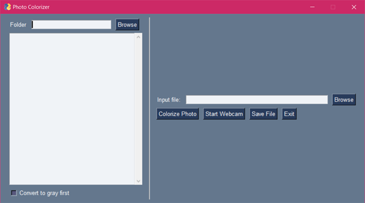
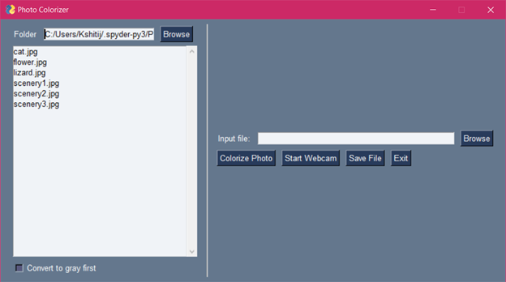
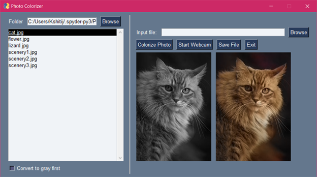
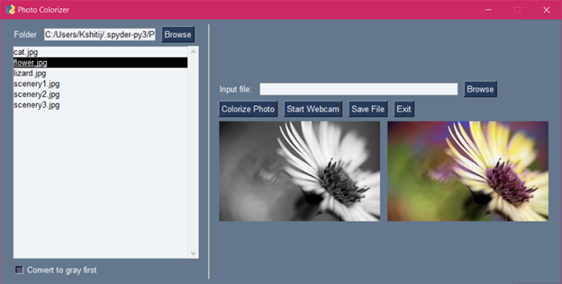
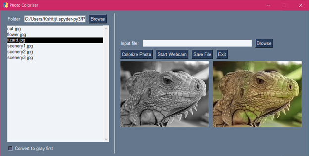
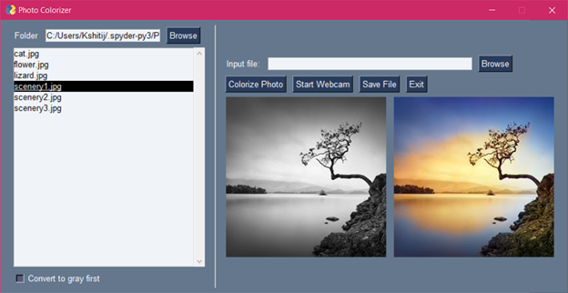
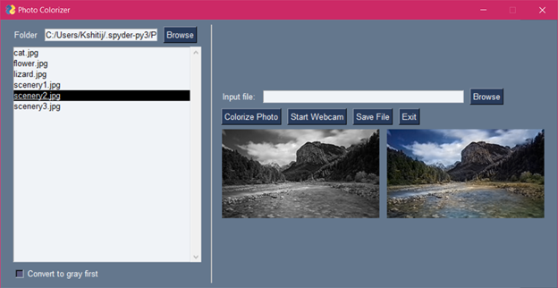
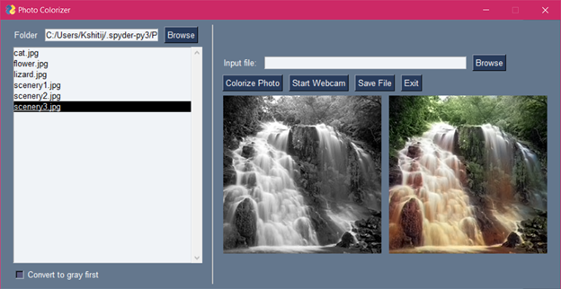
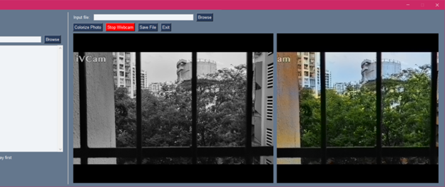

# Colourize-BlacknWhite-Photos
Photo Colorizer is a Python GUI application that automatically adds color to black and white images using a deep learning model. Users can select images from folders or capture live webcam feeds, optionally convert them to grayscale, and save the colorized results. Built with PySimpleGUI, OpenCV, and NumPy, it offers an intuitive interface for effortless image enhancement.

## Features

- **Batch Image Selection:** Choose images from a folder or browse individual files.
- **Webcam Support:** Capture and colorize live video feeds.
- **Grayscale Conversion:** Optionally convert images to grayscale before colorization.
- **Save Results:** Easily save the colorized images in your desired format.
- **User-Friendly Interface:** Built with PySimpleGUI for an easy-to-navigate experience.

## Important
**In order to run the demo, you will first need to download the pre-trained data from this location. At 125 MB it's too large to put into the GitHub.**
!(https://www.dropbox.com/s/dx0qvhhp5hbcx7z/colorization_release_v2.caffemodel?dl=1)

## Screenshots

**Graphical User Interface**

**Load Folder**

**Image 1**

**Image 2**

**Image 3**

**Image 4**

**Image 5**

**Image 6**

**Live Video Colourization**

